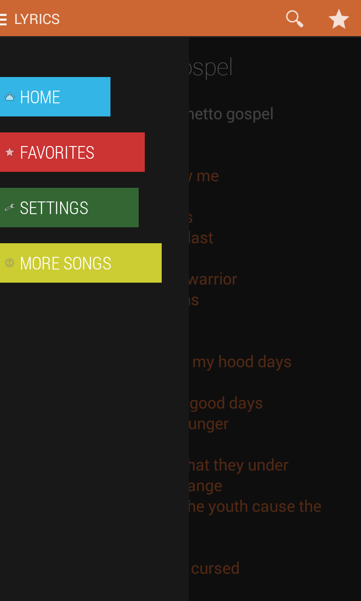
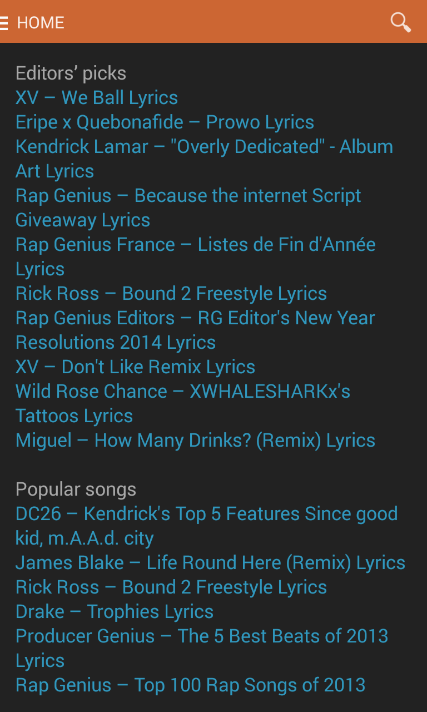
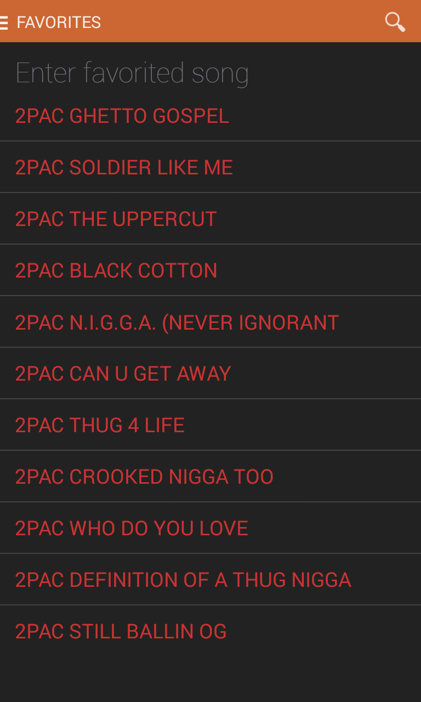
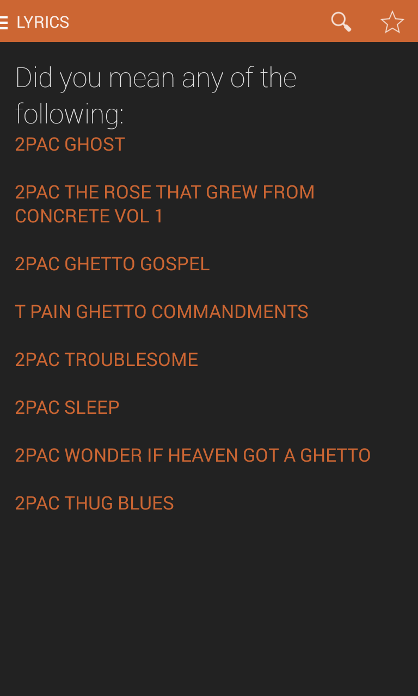
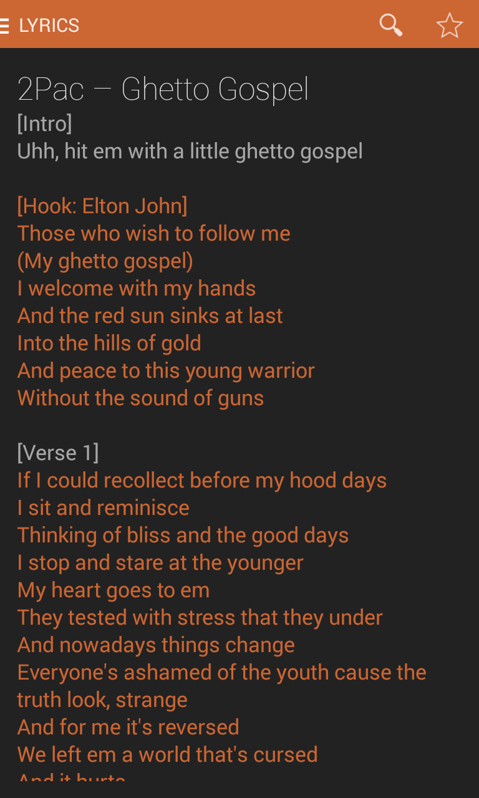
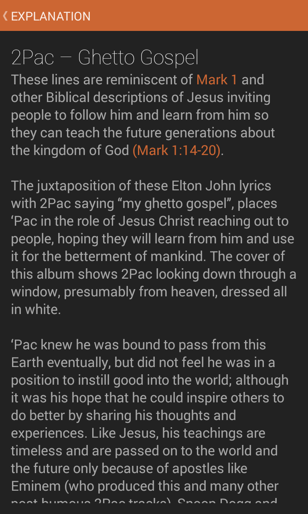
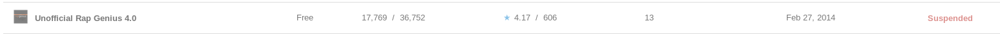

<h1>Description</h1>
This is the unofficial Rap Genius android app. 
It parses explanations and lyrics from RapGenius.com. 
Officially supports English, other languages may work. 
Supports 2.3+.

Some Screenshots: 

 
<

 

<h2>DISCLAIMER:</h2> 
This app's creation is in no way associated with Rap Genius. 
Rap Genius, from an email conversation with someone from their team,  
appears to be fine with this application as long as it remains free.

Unfortunately, this app was removed from the market place due to a DMCA complaint by the NMPA, 
citing copyrighted lyrics from another lyrics site (not Rap Genius). 
 

<h1>Installation Instructions</h1>
Two choices for installation: 
1) Easiest way to install the app is to just grab the <i>.apk</i> and install it onto your device. 
2) Download/pull the entire source and import it into Eclipse*. Compile and run it on your device,
	or export it to an <i>.apk</i> yourself (<b>File</b> -> </b>Export..). 
	The latter requires generating a key store.

If you had installed this app from the market, you should remove that version before installing this,
to avoid any problems.

You could try importing the project to Android Studio, but you'll have to modify the build.gradle.

*Be sure to remove the exclude screenshots from Eclipse after downloading.

<h1>Notes</h1>
Feel free to contribute any new features or better implementations.

Tried to keep most of the code pretty straightforward, 
but I'm sure some of it could use some cleaning up.
